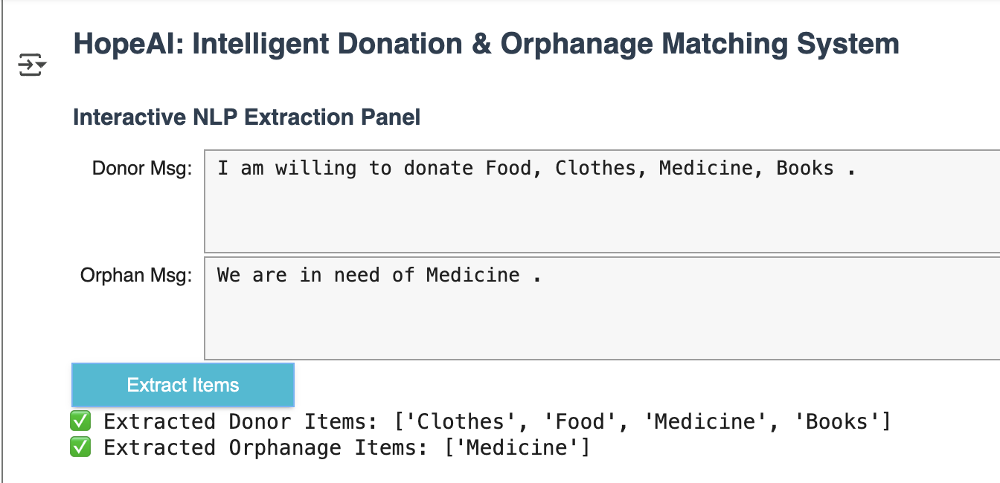

HopeAI - An Intelligent Donation & Orphanage Matching System 🕊️

Overview :

HopeAI is a professional-grade AI system designed to connect orphanages with donors through intelligent matching.
It leverages machine learning and natural language processing (NLP) to ensure that donations reach the right orphanage at the right time, optimizing impact and efficiency.

Features :

^ Smart Matching Algorithm – Matches orphanages and donors by donation type, urgency, and location proximity.

^ AI-powered NLP – Extracts donor intentions and orphanage requests directly from plain text messages .
## Screenshot: NLP Panel

^ Interactive Dashboard – Displays urgent orphanages, top donors, and live matches.

^ Predictive Analytics – Forecasts donation needs using historical trends.

^ Scalable Design – Easily extendable with real-world datasets and NGO integrations.

Dataset :

^ The system is powered by structured CSV files:

^ orphanages.csv → Orphanage details, needs, and urgency

^ donors.csv → Donor profiles, preferences, and availability

^ historical_donations.csv → Past donations enabling predictive analytics

Tech Stack :

^ Python (pandas, numpy, scikit-learn)

^ Data Visualization (matplotlib, seaborn, Streamlit/Dash/Colab UI)

^ Database (SQLite / CSV files)

^ Machine Learning & NLP for matching and text extraction

Impact :

^ HopeAI demonstrates the ability to:

^ Build an end-to-end AI solution from data generation to deployment

^ Apply data science and machine learning to solve real-world social challenges

^ Deliver a professional, resume-worthy project showcasing technical and problem-solving skills
